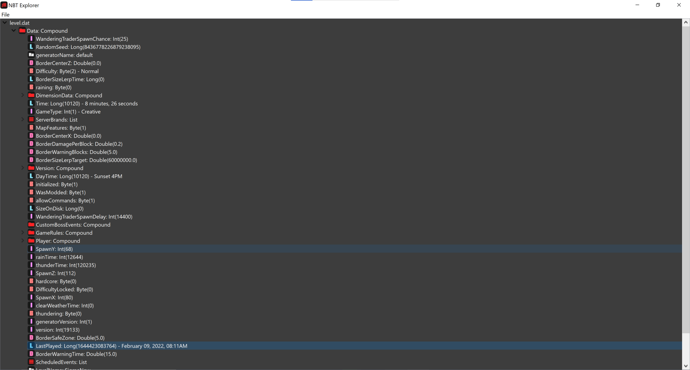
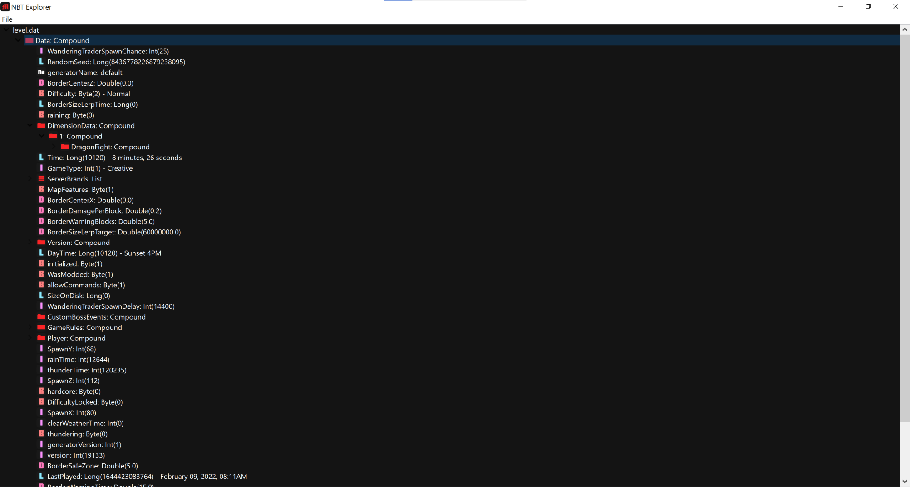
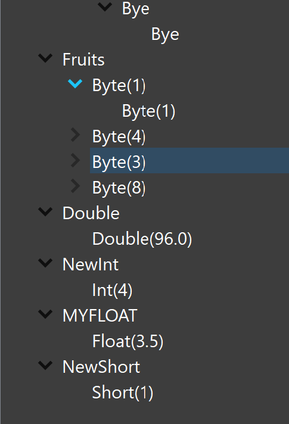
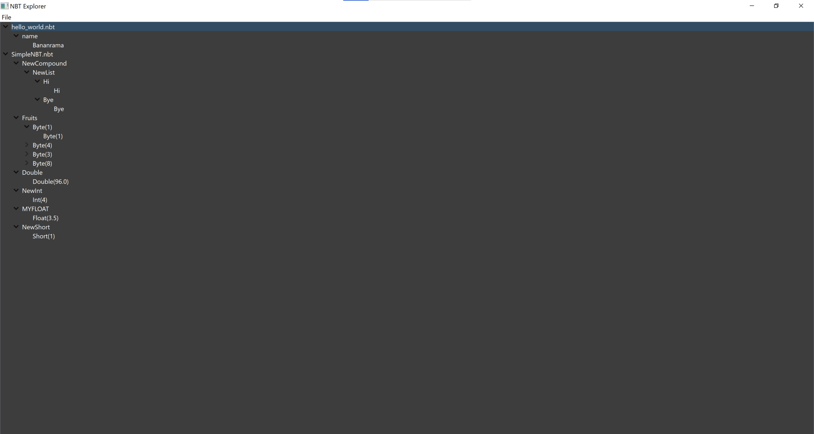

# NBTViewer
Simple Python PyQt dark themed NBT reader/viewer for small/big endian NBT files (Uncompressed, though really easy to add compressed support)! Using the NBTLIB python library!!!!

 With Updated FOlder Icon / LOgo")

